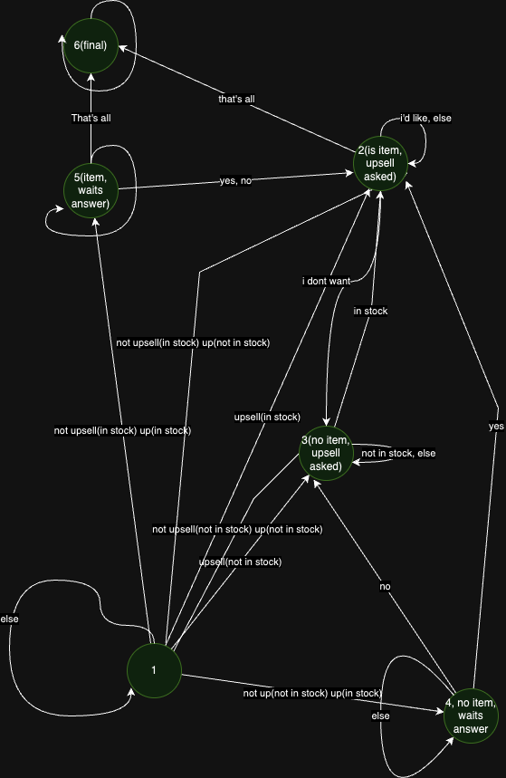

# Restaurant ordering service

### Description
This is a simple ordering service. It allows you to comunicate with a restaurant via simple chat messages. Also, you can get statistics about orders and items.
Here is a list of technologies that were used in the project:  
**FastAPI, PostgreSQL, Docker, Docker-compose, Streamlit, GoogleCloud**

### How to run the project

1. Clone the repository
```shell
git clone https://github.com/Vitalik001/Restaurant_Order_Taker
```

2. Go into the project directory
```shell
cd Restaurant_Order_Taker
```

3. Run a command in the root directory
```shell
docker-compose up
```

4. Open the browser and go to the address

[Front page](http://localhost:8501/) or [Docs page](http://localhost/docs#)


### Chat logic



### API description
```shell
GET /admin - admin root
GET /admin/orders - get completed orders
GET /admin/stats - get orders statistics
POST /admin/add_menu_item - add new item to menu
PUT /admin/change_stock - change stock of menu item
GET /admin/get_menu - get menu from admin

GET /guest - guest root
GET /guest/menu - get menu from guest
POST /guest/create_session - create new order
POST /guest/send_message/<session_id> - send message to restaurant

GET / - main page
```
